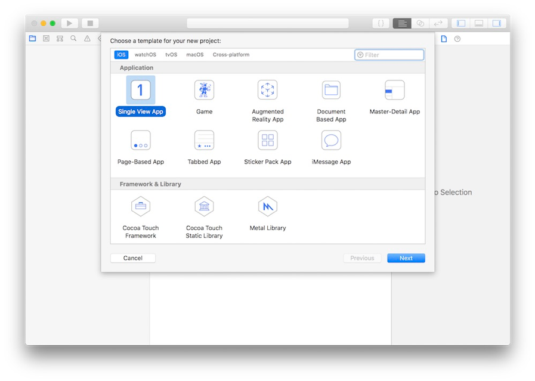
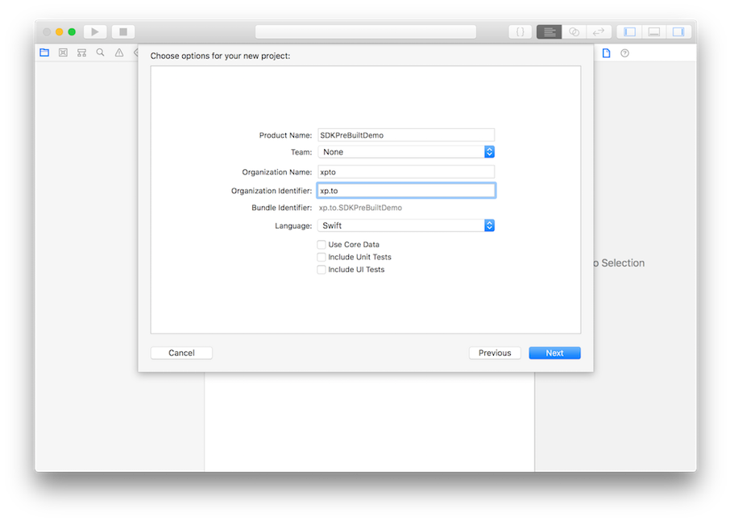
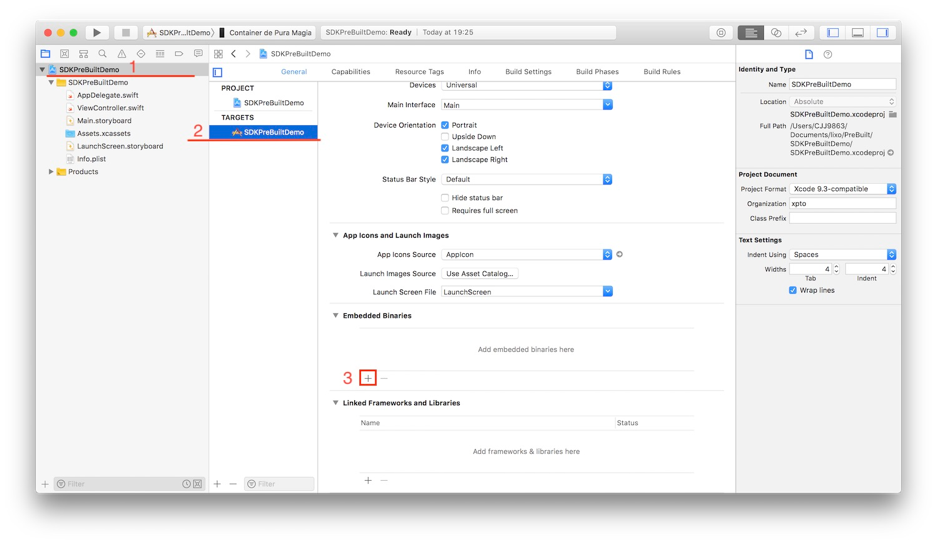
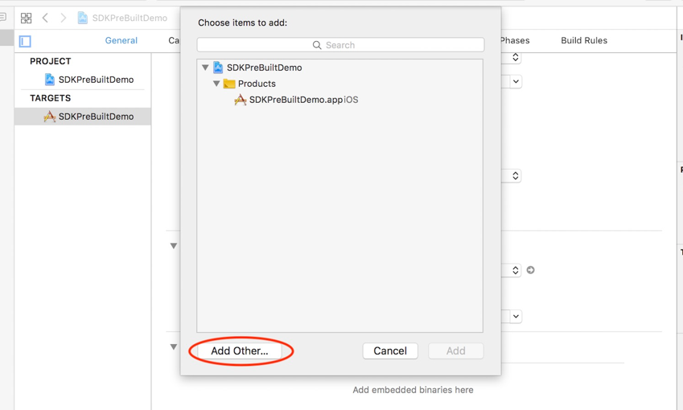
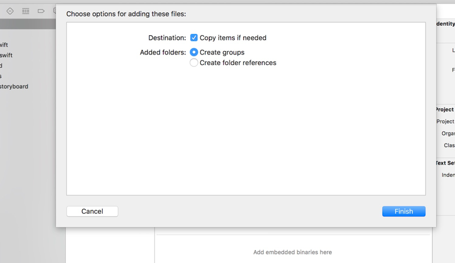
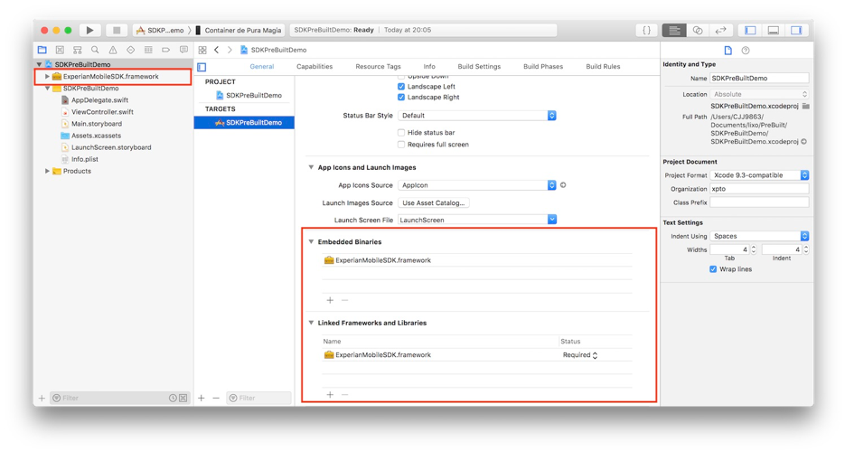
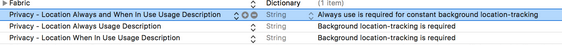

# Mobile Insights Plataform

### Manual de Instalação e Utilização iOS

## Pré requisitos

- Xcode 10
- Swift 4.2+ ou Objective-C


## Instalação

### 1 - Projeto Inicial

Abra o Xcode e crie um novo projeto **Single View App**.






### 2 - Instalando o Framework

Selecione o projeto **SDKPreBuitDemo na coluna Navigator** e o Target **SDKPreBuiltDemo na coluna ao lado** da anterior.

Desça a tela de conteúdo(central) até o final e aperte o botão “+” na seção **Embedded Binaries**




Na tela de seleção de frameworks, aperte **Add Other…** e procure pelo framework **ExperianMobileSDK** no local onde este foi salvo.



Mantenha as opções selecionadas de acordo com a ela seguinte e aperte o botão **Finish** para finalizar o processo de inclusão do Framework no projeto.




Agora que o framework foi adicionado deverá ter uma ocorrência do arquivo ExperianMobileSDK.framework no File Navigatore outra na seção Embedded Binaries e Linked Frameworks and Libraries, ambas na presentes na seção de conteúdo do Xcode



### 2.1 Permissões

Abra o Arquivo `Info.plist` e crie adicione as chaves `NSLocationUsageDescription` e `NSLocationWhenInUseUsageDescription`.

```xml
<key>NSLocationUsageDescription</key>
<string>Sua mensagem</string>
<key>NSLocationWhenInUseUsageDescription</key>
<string>Sua Mensagem</string>
```




### 3 - Execução

### 3.1. Swift

Importe o framework **ExperianMobileSDK** no arquivo AppDelegate.swift e adicione as seguintes linhas no métodos **application(\_, didFinishLaunchingWithOptions)** e **application(\_, performFetchWithCompletionHandler)**.


##### AppDelegate.swift

```swift
import UIKit
import ExperianMobileSDK
 
@UIApplicationMain
class AppDelegate: UIResponder, UIApplicationDelegate {
 
    ...
 
    func application(_ application: UIApplication, didFinishLaunchingWithOptions launchOptions: [UIApplication.LaunchOptionsKey: Any]?) -> Bool {
        EXMobileSDK.run(application: application)
 
        return true
    }
 
    ... 
 
    func application(_ application: UIApplication, performFetchWithCompletionHandler completionHandler: @escaping (UIBackgroundFetchResult) -> Void) {
       EXMobileSDK.backgroundFecth(completion: completionHandler)
    }
 
 
}

```

### 3.2. Objective-C

Importe o cabeçalho **ExperianMobileSDK/ExperianMobileSDK-Swift.h** no arquivo AppDelegate.m, importe o Modulo **ExperianMobileSDK** e adicione as seguintes linhas no métodos **application(\_, didFinishLaunchingWithOptions)** e **application(\_, performFetchWithCompletionHandler)**.


##### AppDelegate.m

```objc
#import "AppDelegate.h"
 
#import "ExperianMobileSDK/ExperianMobileSDK-Swift.h"
@import ExperianMobileSDK;
 
 
@interface AppDelegate ()
 
@end
 
@implementation AppDelegate
 
...
 
- (BOOL)application:(UIApplication *)application didFinishLaunchingWithOptions:(NSDictionary *)launchOptions {
    [EXMobileSDK runWithApplication:application];
    return YES;
}
 
...
 
- (void)application:(UIApplication *)application performFetchWithCompletionHandler:(void (^)(UIBackgroundFetchResult))completionHandler {
    [EXMobileSDK backgroundFecthWithCompletion: completionHandler];
}
 
...

```

### 4.0. Build (Somente em Obj-C)

Dentro da Aba **Build Settings** do target desejado, atribua o valor **Yes** para o atributo **Always Embed Swift Standard Libraries**

[](./assets/img/img_04_03.png)


## Utilização

### 5 - Compartilhando Dados


### 5.1 Swift

##### ViewController.swift

```swift
import UIKit
import ExperianMobileSDK

class ViewController: UIViewController {
    
    @IBOutlet weak var gamerTagTextField : UITextField!

    override func viewDidLoad() {
        super.viewDidLoad()
        EXMobileSDK.executeInstant()
    }    
}
```

### 5.2. Objetive-C

##### ViewController.m

```objc
#import "ViewController.h"
#import "ExperianMobileSDK/ExperianMobileSDK-Swift.h"

@interface ViewController ()

@end

@implementation ViewController

- (void)viewDidLoad {
    [super viewDidLoad];
    [EXMobileSDK executeInstant];
    // Do any additional setup after loading the view, typically from a nib.
}

@end
```